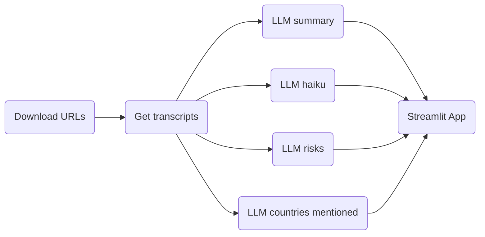

# UN General Assermbly 79 Speeches

The app analyses the speech of each country at the #UNGA79 in 2024. It presents 
a summary of the speech, a list of risks identied in the the speech, what other 
coutries were mentioned and the sentiment in the sentences and a haiku based on 
the speech.

The process is the following:


[ See the app](https://unga79.streamlit.app)


## LLM application

* [x] Summary of the speech
* [x] List of countries mentioned and sentiment
* [x] Risks mentioned in the speech
* [x] Top 3 most important ideas mentioned
* [ ] Emotion detection: speech, such as happiness, sadness, anger, or excitement
* [ ] **Inference Generation**: Use LLMs to generate inferences based on the speech content, such as predicting potential consequences of policy decisions oranticipating international reactions.
* [ ] **Speech Emotional Arc Analysis**: Analyze the emotional tone of the speech over time to identify potential shifts or arcs in sentiment. This can provide insight into the leader's communication strategy or audience engagement.

## Usage

```bash
# Clone this repository
git clone https://github.com/darenasc/unga79.git
# Change directory to repository
cd unga79
# Install dependencies
pipenv install Pipfile
pipenv install -d Pipfile
# Activate Python environment
pipenv shell
# Run the streamlit app
streamlit run app/app.py
```

## Resources
- [#UNGA79 Youtube](https://www.youtube.com/watch?v=pH19ivsC62E&list=PLwoDFQJEq_0YukP-06eOEinhpM2GeG3hY)
- [UNGA79](https://docs.google.com/spreadsheets/d/1qtqfnRSW24j-XLN7SRKywDCuFatARCH8pUg1Rr6I2vI/edit?gid=1290530125#gid=1290530125)